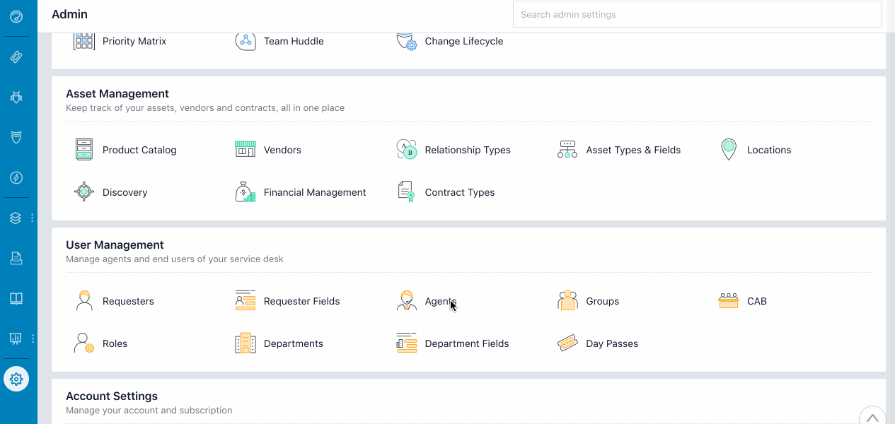

# How to create Agent in FreshService
You can add all your technicians and managers as technicians to your service desk by clicking on the Agents icon under the Admin tab.

When you add a new agent, their role will determine the kind of access* they'll have in the service desk. If multiple roles are set for an agent, the higher level of access will apply. At the maximum restriction, you can choose to only allow agents to view tickets that have been assigned to them, or at the minimum, give them complete access to your help desk including the setup and configurations under the Admin tab.

### A quick guide to adding agents to Freshservice:

