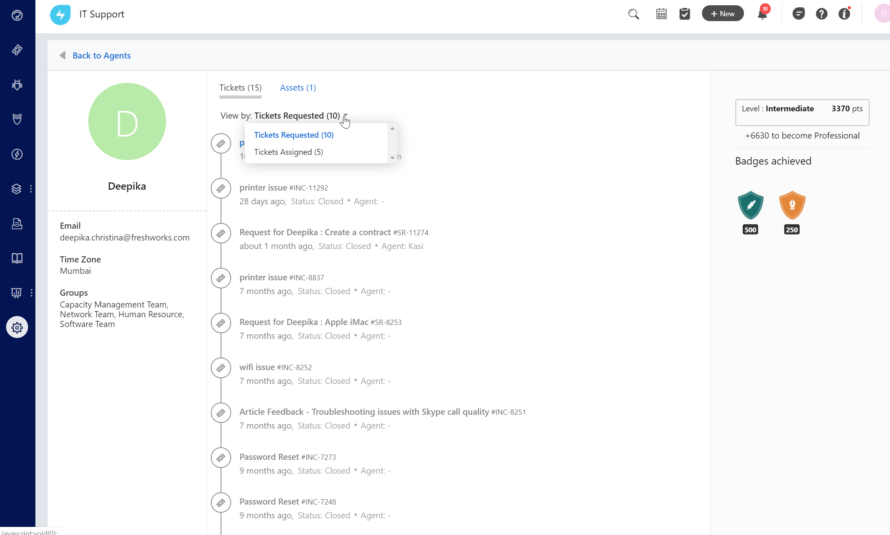
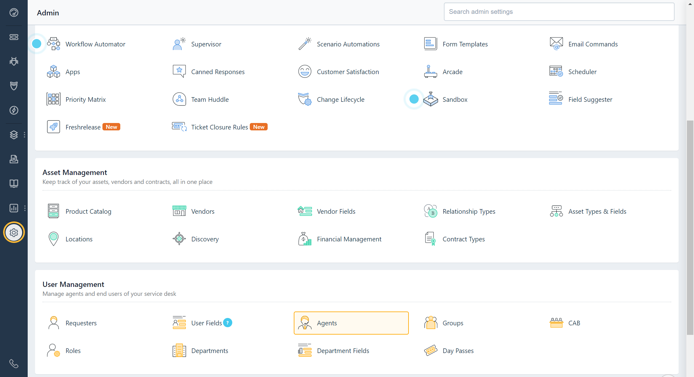
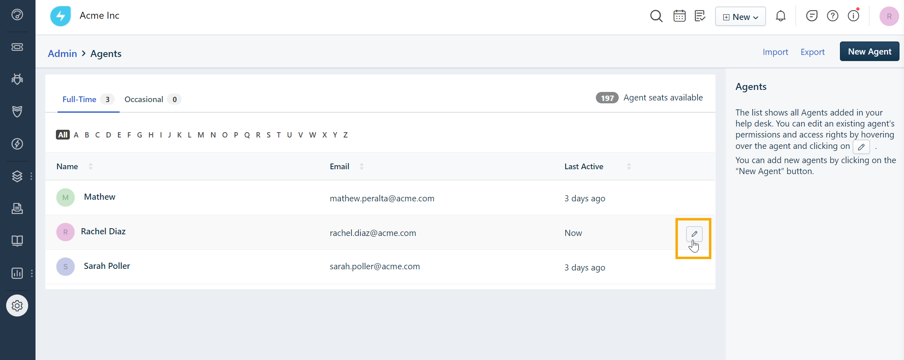
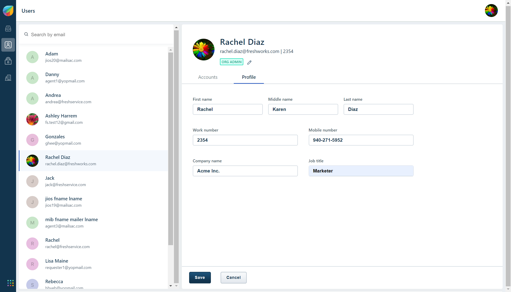
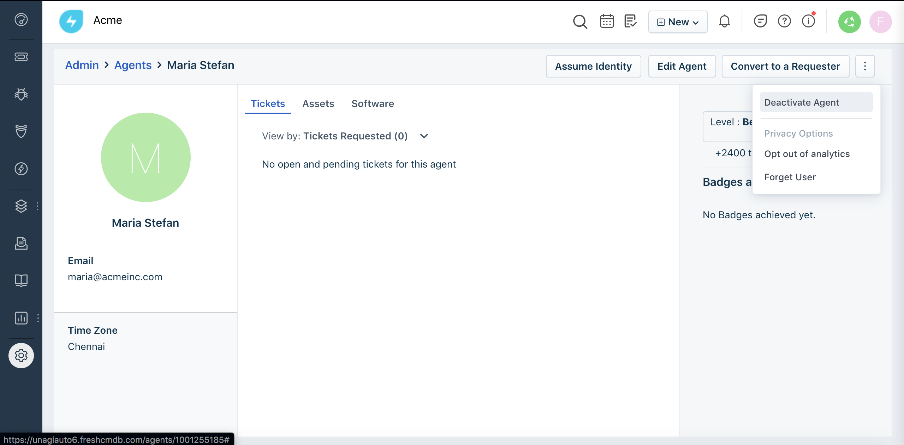

# How to create Agent in FreshService
We can add Engineers and managers as technicians to service desk by clicking on the Agents icon under the Admin tab.

When we add a new agent, their role will determine the kind of access* they'll have in the service desk. If multiple roles are set for an agent, the higher level of access will apply. At the maximum restriction, we can choose to only allow agents to view tickets that have been assigned to them, or at the minimum, give them complete access to our help desk including the setup and configurations under the Admin tab.

### A quick guide to adding agents to Freshservice:

1. Login to your Freshservice account as an administrator.
2. Go to Admin > Agents to start adding agents.
3. Click on the New Agent button on the top.
4. Specify if the agent to be full-time or occasional.
5. Type in basic information about the agent, including name and email address.
6. Add the agent to relevant groups.
7. We can optionally add a profile picture and describe what the agent will be doing in the organization.
8. Choose a role for the agent by clicking on the Associate Role button.
9. Click on Save.

The agent will now receive an activation email in his mailbox which will help him in setting up a password and activating his account in your service desk.

## View Agent Profile

Once we are done adding agents to service desk, we can view their profile. This will contain details about the agent such as their email addresses, groups they belong to, badges they've received as a part of the arcade, etc. You can also view the tickets requested by them and the tickets and assets that have been assigned to them. 

## To modify Agent Profile information using Freshworks Org account: 

1. Access Freshservice account. 
2. Click the Admin Settings icon. 
3. Click Agents under User Management. The list of Agents in service desk will be displayed.

4. Hover over the Agent's name whose profile needs to modify. 
5. Click the edit icon. The Edit Agent page will appear. 

6. Click the View Their Profile CTA. The Users Org page will open in a new tab.

7. We can edit the Name, Number, Company Name, and Job Title under the Profile tab.
8. Click Save to finalize the changes. 

## How to deactivate agents in Freshservice?

In order to deactivate an agent, navigate to Admin -> Agent -> Agent Name -> Deactivate Agent

## What happens when an agent is deactivated?

- The agent will not be able to login to Freshservice. In case of activation, the admin can navigate to Admin -> Agents -> Agent Name -> Activate.
- we will not be able to assign entities (such as tickets, problems, assets and projects) to them.
- All tickets assigned to the agent with Open, In Progress or Pending statuses will automatically become unassigned.
- All tickets assigned to the agent with Resolved and Closed statuses will remain as it is.
- The agent will automatically be removed from all account level configurations except workflow automator, in which users will have to manually remove the agent from the associated workflow.

## Manage Group Memberships for Agents

The Create Agent (New Agent) and Edit Agent pages provides the ability to:

- Add an agent to one or more groups. 
- View the groups that an agent is a member of.
- Remove an agent from one or more groups.
- The View Agent page provides the ability to view the groups that an agent is a member of.

*Note:*

- Account Admins, Admins, and agents belonging to custom roles with the "Play God with Super Admin control "privilege can view and modify group memberships for themselves and other agents.
- Agents belonging to custom roles with the "Manage Agents" privilege (and without "Play God with Super Admin controls") can view group memberships of all agents but can modify group memberships only for other agents and not for themselves.
