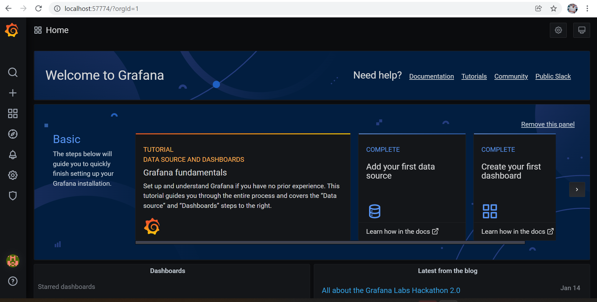
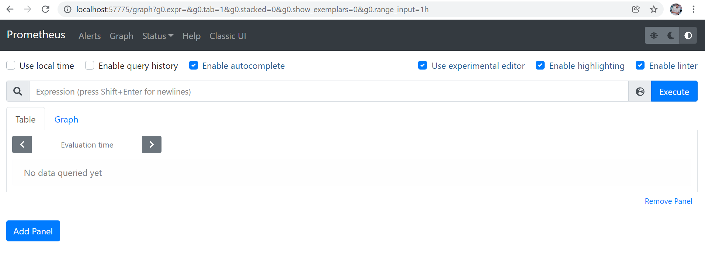
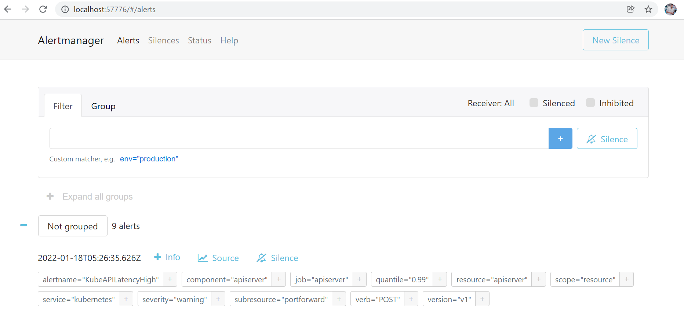
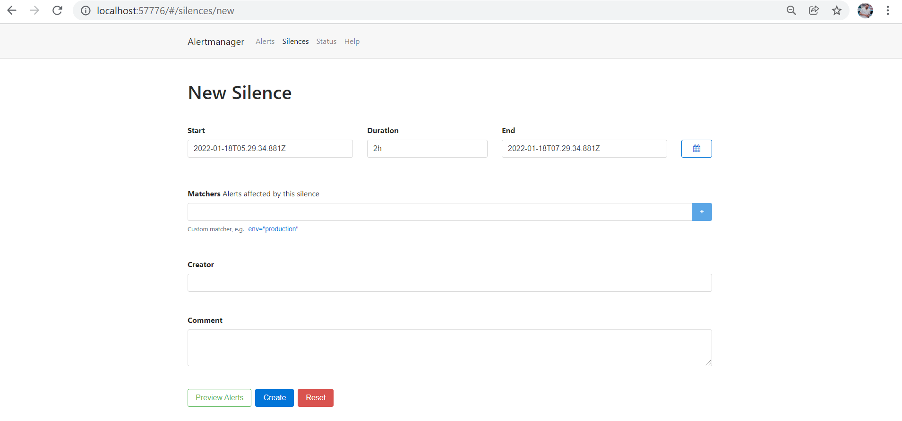

# VSOC Production Support Document

## Basic Information about Clusters available in VSOC

There are currently three clusters running in VSOC to receive/collect logs from the customer environment.
```
 NAME         AGE    HUMANREADABLENAME            OWNER                VERSION   PAUSED

bdfxgh22ng   209d   user-vsockkp-wacker-dev-ir   vsoc@kubermatic.io   1.19.15   false
h4wgbzj95d   209d   user-wacker-prod             vsoc@kubermatic.io   1.19.15   false
nnsmbb9bv2   139d   user-wobcom-Frankfurt        vsoc@kubermatic.io   1.20.11   false
```
Clusters can be easily identified from the HumanReadableName, Name consists of "Customer name + Environment name" to identify easily.
<br>

### How to login to a cluster in command line

Execute the command ```kkp-cluster``` and choose the required cluster from list.

### How to login to Grafana

Grafana is used to visualize the logs/metrics from the monitoring data, Grafana can read input from multiple sources like, Prometheus,Loki,Influx etc.
To access the grafana from VSOC, You can do port forward to local and access the UI.

```
kubectl port-forward svc/grafana -n monitoring 57774:3000
```

Go to your browser and past below URL
```
http://localhost:57774/
```




### How to login to Prometheus
Prometheus is used to scrape the metrics from the kubernetes cluster, we can write pometheus query and get the data in a Table/Graph format for the time period of available metrics.
To access Prometheus, You can do port forward to local and access the UI.

```
kubectl port-forward svc/prometheus -n monitoring 57775:9090
```

Go to your browser and past below URL
```
http://localhost:57775/
```



### How to login to AlertManager

AlertManager is for alerting, it reads the metrics from prometheus and as per the defined conditions triggers the alert.

To access AlertManager, You can do port forward to local and access the UI.
```
kubectl port-forward svc/alertmanager -n monitoring 57776:9093
```
Go to your browser and past below URL
```
http://localhost:57776/
```




### How to Silence the Alert from AlertManager

After you login to AlertManager , Click on ```New Silence``` . Then you will get a new page like below.



 Here you have to ensure you fill the correct details and by clicking ```Preview Alerts``` verify you are going to silence the right alert for the particular environment.<br>
 Click on ```Create``` to silnce the alert
