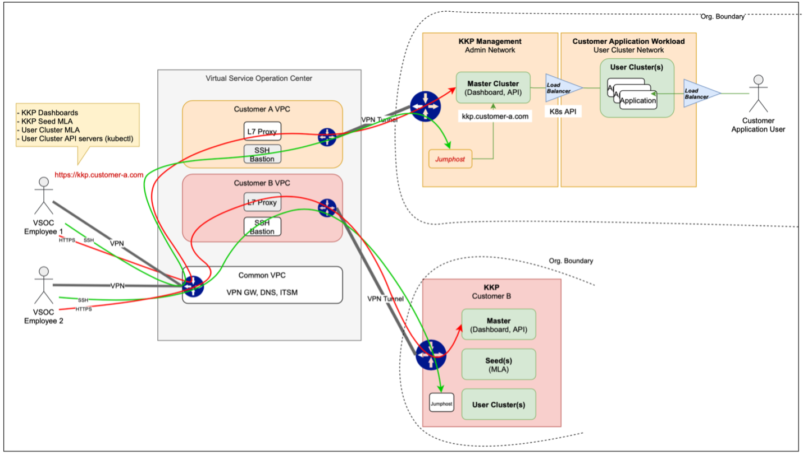
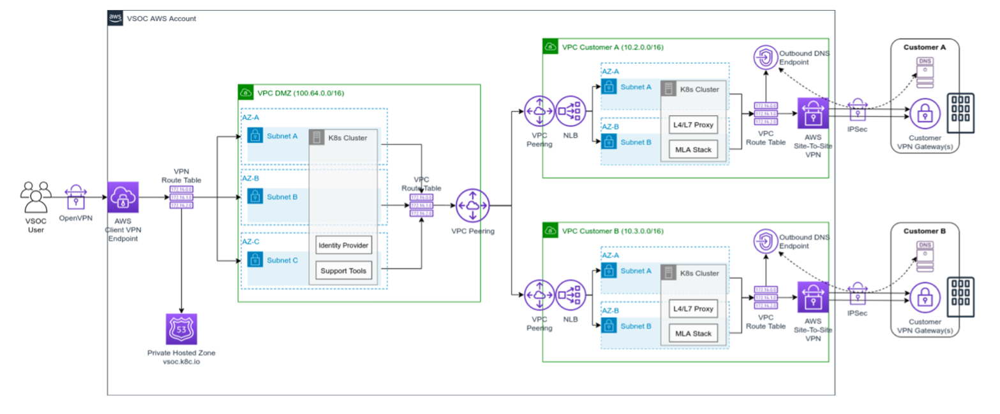
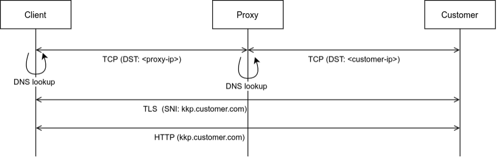
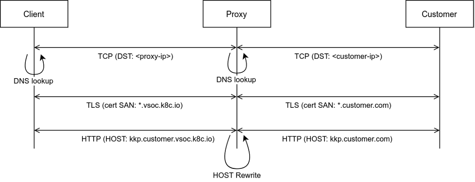

# VSOC Architecture Documentation

A virtual SOC is a secure web-based tool that allows you to easily monitor the security of your systems in real-time. This centralized command and control center enables together control of security operations, a better view into the security posture of your organization, and a one-stop-shop for all your security monitoring and incident response needs, not to mention that it’ll help you pass those pesky audits as well. As you know, the old philosophy of defending the walls of an enterprise is dead; it’s safe to assume that your organization will be compromised, and probably already has been. But, by using a virtual SOC, administrators can prioritize security events by focusing on the incidents that have the most impact to your business, using the latest threat intelligence to prioritize, respond and remediate.
<br>



In the above diagram, one can see the overall VSOC architecture and the entry points for respective employees, i.e., VSOC employee and Customer Employee. 

<br>
Virtual Service Operation Center (VSOC) running in a cloud infrastructure is designed to provide easy access to KKP installations of different customers for Managed Service Provider operators. The solution should meet the following requirements: 
<br>
<ul>
  •	The network communication between the VSOC and the customer infrastructure should be secured (customers tend prefer IPSec Site-to-Site tunnels).<br>
  •	The network communication between the VSOC users (Managed Service Provider operators) and the VSOC should be secured as well (any type of VPN connection).<br> 
  •	The VSOC users should be able to easily authenticate (SSO is preferred) on to  VSOC and on to customer KKP platforms. <br>
  •	Every action an VSOC user does in VSOC must be traceable and stored in an audit stream. <br>
  •	Relevant customer data is stored at VSOC, but separate from the data of other customers. <br>
  •	Support ticket tool should run in the VSOC. <br>
  </ul>
<br>
The VSOC networking will be based on multiple AWS VPCs (Virtual Private Clouds):
<ul>

o **DMZ VPC** : shared VPC used to connect VSOC end-users (Managed Service Platform operators) and potentially customer users to the VSOC. This VPC acts as a networking “hub” towards Customer VPCs. It also hosts a k8s cluster with services shared across all customers, such as support/ticket tools. 

o **Customer VPCs** : A dedicated VPC per customer is used to connect towards the customer infrastructure. It also hosts a k8s cluster with services specific to the customer, such as MLA (Monitoring, Logging and Alerting) stack. Apart from some technical reasons for the per-customer VPC separation (higher security, limitation of 1 AWS Site-to-Site VPN Gateway per VPC), it also allows for potential per-customer AWS Account separation and billing. 

</ul>
<br>
<br>

From the networking perspective, both types of VPC will be “private” - there will be no endpoints directly exposed on the Internet in them. The k8s nodes running in them will have Internet access to be able to download container images (via AWS NAT Gateway). 
<br>
<br>
The connection to VSOC will be based on two types on VPN: 
<ul>

•	**AWS Client VPN**: to provide VPN access to the VSOC for end-users (Managed Service Platform operators) and potentially customer users. It is an OpenVPN-based managed solution from AWS with built-in high availability. The end user can access it either using the AWS Client VPN for Desktop software, or using the open-source OpenVPN client software. <br>
•	**AWS Site-to-Site VPN**: to provide Site-to-Site VPN access from Customer VPCs to Customer Infrastructure. It is an IPSec-based managed solution from AWS with built-in high availability. For each customer, we can create VPN tunnels to multiple Customer VPN devices (Firewalls / VPN Gateways of various vendors). 

</ul>
<br>
<br>
The Routing between the DMZ VPC (with client VPN termination) and Customer VPCs (with Site-to-Site VPN termination) will be based on AWS VPC peering, as shown on the following picture: 



<br>

## DMZ VPC 
* The DMZ VPC terminates the Client VPN connections and is the entry point for the end-user traffic. The VPC contains multiple (2 or 3) subnets in different availability zones (AZs), to which the Client VPN Endpoint is associated (each VPN-to-subnet association is billed, so we need to find a balance between money saving and high availability - we need at least 2 AZs for redundancy). <br>
* It is necessary that the **subnet** of this VPC does not collide with any customer subnet (any exposed subnet on the customer side of any customer). Therefore, we use a subnet from the IANA-Reserved IPv4 Prefix for Shared Address Space (100.64.0.0/10), usually used by service providers for carrier-grade NAT. <br>
* The **routing table** of this VPC contains routes to all other customer VPCs (connected via VPC peering). That means the end users of the Client VPN can reach the subnets of Customer VPCs just by routing via the DMZ VPC, without the need for any proxy. <br>

* The DMZ VPC will also host a **AWS Route 53 DNS resolver**, which will be configured in the Client VPN profiles as the primary DNS server. It will allow us to create DNS entries for privately hosted zones specific to individual customers - e.g. ```customer-a.domain``` can be resolved to an IP address valid in the CustomerA VPC, which would allow HTTP requests like ```http://kkp.customer-a.domain``` to properly route towards an endpoint (proxy) in the CustomerA VPC. <br>
* Additionally, the DMZ VPC will host a k8s cluster, which can be used to run services shared across all customers, such as support / ticket tools. These can be exposed to the end user via the internal load-balancer services (not exposed to the Internet, but using DMZ VPC private IP), for which we can create DNS entries in Route 53 (e.g. ```support.vsoc.kubermatic.com```). <br>

## Customer VPCs 
<br>

* The customer VPCs connect the VSOC towards the customer infrastructures using the AWS Site-to-Site VPN. Each VPC contains multiple (2 or 3) private subnets in different availability zones (AZs) for high availability. The routing table of each customer VPC contains the routes towards all customer subnets that have to be accessible for the VSOC users. Since these subnets may overlap with the other customers, these routes are never propagated to the DMZ VPC - all access to the customer side needs to go through some endpoint running in the Customer VPC. This means that for traffic originated by the VSOC user we need to run a **forward proxy** in the Customer VPC (described below). <br>
* Additionally, to be able to resolve hostnames valid in the customer infrastructure to private IP addresses valid on the customer side, the customer VPC will contain an Outbound DNS Endpoint, pointed to DNS server(s) at the customer side. If DNS resolving on the customer side is not possible, we would create a Route 53 private hosted zone with necessary hostname to IP mappings in this VPC. Note that custom DNS setup at the CoreDNS level with forwarding of specific zones to an customer side server could serve the same purpose as the Outbound DNS Endpoint and save some AWS costs, but is not supported by KKP at this point. <br>
* Finally, the Customer VPC will host a k8s cluster, which will be used to run customer-specific services such as the above mentioned proxy, or the MLA (Monitoring, Logging and Alerting) stack. These can be exposed to the end user via the internal load-balancer services, for which we can create DNS entries in DMZ-hosted DNS resolver (e.g. `grafana.customer-a.domain`). 
* Optionally, if the Customer VPC requires outbound Internet access (e.g. to pull images from public image repositories), that can be done by introducing of an additional subnet with an Internet Gateway and a NAT Gateway, which can be used as an exit point for the private subnets. 
<br>

## HTTP(S) Forward Proxy 

* As mentioned above, the VSOC users connected via the Client VPN to the DMZ VPC cannot access the Customer subnets directly, because of the private subnet overlaps between multiple customers. To reach endpoints at the customer side, they have to go through a proxy running in the Customer VPC. 
* The proxy will run in the Kubernetes cluster hosted in the Customer VPC, and will be exposed via the internal load-balancer service (not exposed to the Internet, but using Customer VPC private IP). This service endpoint can have a matching DNS entry in the DMZ-hosted DNS resolver, so that e.g. any request to ```*.customer-a.domain``` is resolved to the proper load-balancer IP of the customer forward proxy. 
<br>

## Proxy Ports
The proxy will be listening on the following ports: 
<br>
<ul>
•	80: for proxying of non-encrypted HTTP traffic (e.g. to conveniently redirect to HTTPS for KKP UI), <br>
•	443: for proxying of encrypted HTTPS traffic (mostly to reach KKP UI / monitoring stack UI), <br>
•	6443: for proxying of encrypted traffic towards k8s-apiserver of individual KKP user clusters 
(e.g. for kubectl access), <br>
•	3128: for proxying SSH traffic using HTTP CONNECT method.<br>
</ul>

Note that the port 6443 is used by KKP only if the Tunnelling Expose Strategy is used on KKP. The tunnelling expose strategy is currently a requirement for this solution. The implementation for other expose strategies would be much more complex, as each KKP user cluster’s APIserver is exposed on a different dynamically allocated port (NodePort). That would require exposing the proxy in VSOC on many different ports dynamically, which would require a specific controller running in the VSOC. <br>

## HTTPS Proxying
* The HTTPS proxy will be configured as a **dynamic SNI forward proxy**. It will perform dynamic proxying based on DNS lookups of the original requested hostname based on the SNI information in the TLS handshake. For example, a HTTP request to `kkp.customer.com` is proxied after a DNS lookup for this hostname on the proxy, resolved to a proper destination IP address on the customer side. 
* Note on the picture below, that this type of proxy does not terminate the TLS connection - just forwards the whole TCP payload. Therefore it cannot provide any authentication/authorization/identity logging in the VSOC, as the proxy does not see into the encrypted HTTP payload. 


 <br>
 For specific cases, the dynamic proxy can be overridden with **static mappings**. That can be used if we need to access some services on the customer side that have to run on non-standard ports (not listed in the Proxy Ports section above).

 ### Considered Alternative - MITM HTTPS Proxy 
 * In order to perform authentication & authorization, or at least identity logging of each HTTPS request in the VSOC, we also considered the MITM (Man-In-The-Middle) proxy approach. The MITM HTTPS proxy would terminate the TLS connections in VSOC. That would add the complexity of server certificate management into the scope, but allow for HTTP header inspection and potentially also authentication & authorization. 
 * We assume that we won’t be able to get a proper (not self-signed / custom CA issued) certificate for the customer domains. Custom CA-issued certificates for the customer domains are not a good solution, as it would require installation of the certificate of our own Certificate Authority on the VSOC user hosts. The only option that left is to map customer domains to our own VSOC-specific domain, e.g. `*.customer.vsoc.k8c.io` would be used by the VSOC users for accessing `*.customer.com`, as pictured below: 


* This approach requires rewriting of the HTTP host / authority headers on the proxy. That however does not seem to be compatible with KKP when proxying web sockets connections (used by KKP UI). 
* Also, since k8s clients (e.g. kubectl) validate the API-server's certificate based on the certificate authority data included in the kubeconfig, we cannot do the MITM proxy for api-server connections, unless we have a proper server certificate issued by the k8s control plane CA in the VSOC. 
* Based on the described issues, we decided to go with the SNI-based forward proxy approach because of its simplicity and compatibility compared to the MITM approach. This means that the VSOC user authentication & authorization will have to be left purely on the AWS VPN Client Endpoint, and further authentication & authorization on the customer side. <br>

### SSH Proxying 
SSH traffic can be proxied using the HTTP CONNECT method (HTTP/1.x or HTTP/2). In this case, the VSOC users would be accessing the ssh hosts on the customer side using a ProxyCommand option, e.g.: 
```
ssh <customer-side-host> -o "ProxyCommand nc -X connect -x <proxy-host> %h %p" 
```
For convenience, the VSOC users can put a wildcard Host config into their ssh config file, so that they don’t have to specify the ProxyCommand for each ssh session, e.g. for a customer with `customer.domain` zone: 
```
Host *.customer.domain
ProxyCommand nc -X connect -x proxy.customer.domain %h %p 
```
With that, they can access hosts at `customer.domain` as simply as: 
```
ssh somehost.customer.domain 
```
<br>
<br>

## VSOC-VPC Details:

|    <br>Name     	|    <br>VPC ID       	|    <br>IPv4   CIDR     	|    <br>DHCP   Options set     	|    <br>Main Route Table     	|    <br>Main Network ACL     	|
|:---:	|:---:	|:---:	|:---:	|:---:	|:---:	|
|    <br>vpc-documentation    	|    <br>vpc-0163c78251e8204d6    	|    <br>100.70.0.0/16    	|    <br>dopt-d1fb79bb    	|    <br>rtb-004b3da603123fe60    	|    <br>acl-016a3b479175591c7    	|
|    <br>vpc-cubebikes    	|    <br>vpc-028ec98a2a6201f8a    	|    <br>100.69.0.0/16    	|    <br>dopt-d1fb79bb    	|    <br>rtb-0206bdc3cc3cdad24   / cube-main    	|    <br>acl-0e4a8c85fca85c5c2    	|
|    <br>vsoc1-new   (Production)    	|    <br>vpc-098f9f0dced9c1391    	|    <br>100.65.0.0/16    	|    <br>dopt-d1fb79bb    	|    <br>rtb-0dd91be4cff49bede   / rt-main-vpc-1391    	|    <br>acl-0095c0935b917b303    	|
|    <br>vpc-Stadtwerke-Bielefeld    	|    <br>vpc-0b806a14a1f41738a    	|    <br>100.67.0.0/16    	|    <br>dopt-d1fb79bb    	|    <br>rtb-03d94906671f23a53   / stadtwerke-main    	|    <br>acl-08cf498f9737b6a9f    	|
|    <br>wacker    	|    <br>vpc-00d8b1bc44ac16e08    	|    <br>2 CIDRs     	|    <br>dopt-d1fb79bb    	|    <br>rtb-03acee64ebb13ca3e   / wacker-private    	|    <br>acl-0a8d5930875409c36    	|
|    <br>–    	|    <br>vpc-5ad95b30    	|    <br>172.31.0.0/16    	|    <br>dopt-d1fb79bb    	|    <br>rtb-0626226c    	|    <br>acl-654d120f    	|
|    <br>vpc-wobcom    	|    <br>vpc-080f9d1e47848ea19    	|    <br>100.68.0.0/16    	|    <br>dopt-d1fb79bb    	|    <br>rtb-0623e88bd433b4733   / wacker-main    	|    <br>acl-0486161ece1ab00bb    	|


<br>

## VSOC-Site to Site VPN Connection Details:

|    <br>Name     	|    <br>VPN ID    	|    <br>Virtual Private Gateway    	|    <br>VPC    	|    <br>Customer Gateway Address    	|    <br>Routing    	|
|:---:	|:---:	|:---:	|:---:	|:---:	|:---:	|
|    <br>wobcom-vpn    	|    <br>vpn-033eae680081e3a57    	|    <br>vgw-007c4a1fcc829ffac \|   wobcom-vpn-gw    	|    <br>vpc-080f9d1e47848ea19 \|   vpc-wobcom    	|    <br>62.176.249.5    	|    <br>Static    	|
|    <br>cubebikes-vpn    	|    <br>vpn-0495a2e8e797095ea    	|    <br>vgw-016cadaceca919991 \|   cube-vpn-gw    	|    <br>vpc-028ec98a2a6201f8a \|   vpc-cubebikes    	|    <br>212.184.99.66    	|    <br>Static    	|
|    <br>stadtwerke-bielefeld-vpn    	|    <br>vpn-0750f946c025370ab    	|    <br>vgw-04d1cdea3dc6da8fe \|   stadtwerke-bielefeld-vpn-gw    	|    <br>vpc-0b806a14a1f41738a \|   vpc-Stadtwerke-Bielefeld    	|    <br>91.194.108.24    	|    <br>Static    	|
|    <br>wacker-vpn    	|    <br>vpn-0da302ea72da0e588    	|    <br>vgw-07bf0f1d222944a23 \|   wacker-vpn-gw    	|    <br>vpc-00d8b1bc44ac16e08 \|    wacker    	|    <br>193.18.239.159    	|    <br>Dynamic    	|

<br>

## VSOC EC2 Instances Details:

|                     <br>Name                     	|        <br>Instance ID        	|    <br>Instance type    	|                       <br>Public IPv4 DNS                       	|    <br>Public IPv4 address    	|
|:------------------------------------------------:	|:-----------------------------:	|:-----------------------:	|:---------------------------------------------------------------:	|:-----------------------------:	|
|    <br>wacker-tmp-proxy                          	|    <br>i-05685055d31019ae6    	|    <br>t2.micro         	|    <br>–                                                        	|    <br>–                      	|
|    <br>wackerp-md-f9b5f6998-n2pjc                	|    <br>i-049a5e713d9ec4f47    	|    <br>t3.medium        	|    <br>–                                                        	|    <br>18.185.11.64           	|
|    <br>vsockkp-bastion                           	|    <br>i-06eaa2dc9873ea322    	|    <br>t3.nano          	|    <br>ec2-18-194-41-20.eu-central-1.compute.amazonaws.com      	|    <br>18.194.41.20           	|
|    <br>vsockkp-cp-1                              	|    <br>i-0dfb9dc15e384e871    	|    <br>t3.medium        	|    <br>ec2-3-67-11-212.eu-central-1.compute.amazonaws.com       	|    <br>3.67.11.212            	|
|    <br>wacker-prod-1a-85c7fc9d88-27f8q           	|    <br>i-0a779456ca966334d    	|    <br>c5a.4xlarge      	|    <br>–                                                        	|    <br>3.124.4.102            	|
|    <br>wobcom-bastion                            	|    <br>i-0c526812e264ba992    	|    <br>t2.micro         	|    <br>–                                                        	|    <br>–                      	|
|    <br>wobcom-mla-fra-65dbb54f4c-7bx4t           	|    <br>i-0ae03e1f4b4e40ee4    	|    <br>t3.medium        	|    <br>–                                                        	|    <br>3.121.180.227          	|
|    <br>to-test-dns-envoy                         	|    <br>i-06837001883bc52c9    	|    <br>t2.micro         	|    <br>–                                                        	|    <br>3.65.204.193           	|
|    <br>Stadtwerke-bastion                        	|    <br>i-080026b16a32ccfb5    	|    <br>t2.micro         	|    <br>–                                                        	|    <br>–                      	|
|    <br>for vsoc natgw testing                    	|    <br>i-074e58e2f1af63dcb    	|    <br>t2.micro         	|    <br>–                                                        	|    <br>–                      	|
|    <br>cubebikes-proxy-connect                   	|    <br>i-04cb9d69b45acda5f    	|    <br>t2.micro         	|    <br>–                                                        	|    <br>–                      	|
|    <br>mfa-test                                  	|    <br>i-0a5faf7e2d82ae9bc    	|    <br>t2.micro         	|    <br>ec2-3-125-18-91.eu-central-1.compute.amazonaws.com       	|    <br>3.125.18.91            	|
|    <br>vsockkp-eu-central-1a-547bd6497b-q2x7b    	|    <br>i-0592c7c1369eebf19    	|    <br>c5a.4xlarge      	|    <br>ec2-3-64-10-119.eu-central-1.compute.amazonaws.com       	|    <br>3.64.10.119            	|
|    <br>vsockkp-eu-central-1a-547bd6497b-gfw9g    	|    <br>i-0e4efc152c19878c9    	|    <br>c5a.4xlarge      	|    <br>ec2-18-157-165-236.eu-central-1.compute.amazonaws.com    	|    <br>18.157.165.236         	|
|    <br>new-private-teleport                      	|    <br>i-0dd3732be5c1ba333    	|    <br>t2.medium        	|    <br>–                                                        	|    <br>–                      	|
|    <br>vsockkp-cp-2                              	|    <br>i-0366c1f80778a3e4d    	|    <br>t3.medium        	|    <br>ec2-3-68-190-108.eu-central-1.compute.amazonaws.com      	|    <br>3.68.190.108           	|
|    <br>wacker-prod-1b-9698648c6-29ntz            	|    <br>i-0eb6d80c8271f8ffe    	|    <br>c5a.4xlarge      	|    <br>–                                                        	|    <br>3.65.37.84             	|
|    <br>wobcom-mla-fra-2-cbf6fffd-frh6b           	|    <br>i-0f7cf532e1aad34a1    	|    <br>t2.medium        	|    <br>–                                                        	|    <br>3.68.72.221            	|
|    <br>vsockkp-eu-central-1b-694676cf78-68gqr    	|    <br>i-0ce494ca669751d9b    	|    <br>c5a.4xlarge      	|    <br>ec2-18-198-1-66.eu-central-1.compute.amazonaws.com       	|    <br>18.198.1.66            	|
|    <br>vsockkp-cp-3                              	|    <br>i-08d849f07e350fe30    	|    <br>t3.medium        	|    <br>ec2-3-67-199-156.eu-central-1.compute.amazonaws.com      	|    <br>3.67.199.156           	|
|    <br>vsockkp-eu-central-1c-6d74c68bcd-tq9jm    	|    <br>i-058c81e094ee96dca    	|    <br>c5a.4xlarge      	|    <br>ec2-3-71-25-126.eu-central-1.compute.amazonaws.com       	|    <br>3.71.25.126            	|
